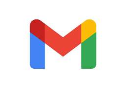

 

### Hi there 👋
Iam a Cameroonian engineer in industrial engineering, excellent at design, project management and handling pressure. 
I am heavily interested in new technologies and the possible applications of tools from data science and artificial intelligence in all industrial area. 
This interest lead me to enroll at AIMS for a master’s degree in industrial mathematics where I am currently gaining remarkable skills and experience in 
the fields of data science and machine learning.

- 🔭 I’m currently working on a Computer Vision project.
- 🌱 I’m currently learning best practices for **NLP** and **Computer Vision**.
- 👯 I’m looking to collaborate on any **AI** or **Web Development** project.
- 🤔 I’m looking for help with ...
- 💬 Ask me about **ML** or **Data Science**
- 📫 How to reach me: contact me directly on this mail cyrille.feudjio@aims-cameroon.org

<!--
**cyrille-feu/cyrille-feu** is a ✨ _special_ ✨ repository because its `README.md` (this file) appears on your GitHub profile.

Here are some ideas to get you started:

- 🔭 I’m currently working on a Computer Vision project.
- 🌱 I’m currently learning best practices for **NLP** and **Computer Vision**.
- 👯 I’m looking to collaborate on any **AI** or **Web Development** project.
- 🤔 I’m looking for help with ...
- 💬 Ask me about **ML** or **Data Science**
- 📫 How to reach me: contact me directly on this mail cyrille.feudjio@aims-cameroon.org
-->
